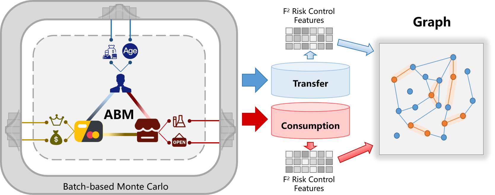
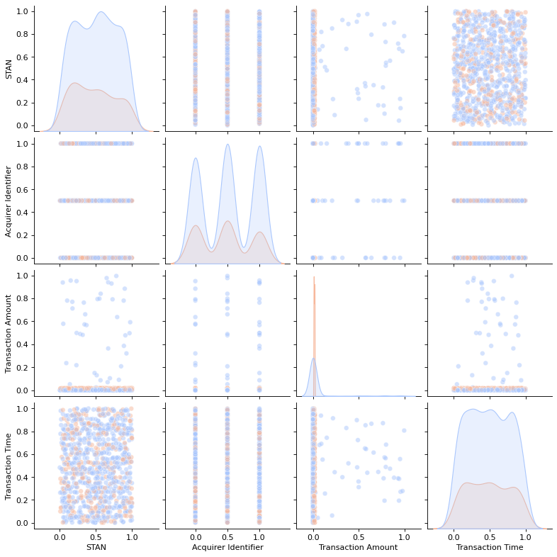
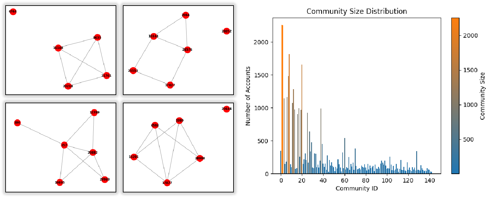

<link rel="stylesheet" href="https://cdn.jsdelivr.net/npm/katex@0.16.9/dist/katex.min.css">

This document presents the simulation engine underpinning **F²-Gen**, an open-source platform for multi-scenario financial fraud data generation. The engine supports six major types of fraud behaviors—including credit card abuse, illegal gambling, merchant violations, and wire fraud—through a unified agent-based and transaction-level modeling framework.

While wire fraud is used as the illustrative example in this document, the described methods apply across all six fraud scenarios supported in the platform.

For general usage, refer to the [Usage Guide](usage.html). For theoretical background and modeling principles, see the [Technical Report](technical.html). return to the [Homepage](index.html).

---

  With the rapid digitization of financial transactions and the proliferation of digital payment channels, wire fraud---criminal activities that deceive others through electronic communication for illicit gain---has become increasingly sophisticated. Forecasts indicate that wire fraud results in annual losses exceeding trillions of dollars, with a sustained growth rate of over 15%. Unfortunately, no publicly available datasets currently exist to facilitate targeted interventions against more than 3 identified fraud scenarios. To address this gap, this document introduces a dataset generator specifically designed for wire fraud transactions, as well as a graph-based risk control framework generator optimized for graph learning applications. The toolkit is available as an open-source package and can be accessed through docker and pip.

# Background and Purpose

According to [18 U.S. Code § 1343](#ref-USC_18_1343_2023), Wire Fraud refers to obtaining money or property through three distinct scenarios---wire, radio, or television communications---by means of false or fraudulent pretenses, representations, or promises. With the expansion of digital transactions and financial derivatives, fraud tactics have become increasingly sophisticated, leading to significant economic losses. In the past five years, global wire fraud has resulted in over \$10 trillion in annual losses, with a sustained growth rate of over 15% [CybersecurityVentures](#ref-CybersecurityVentures_2025), [Desolda et al., 2021](#ref-10.1145/3469886), [IC3](#ref-IC3_2024), [CertifID, 2024](#ref-CertifID_2024). Despite the severity of the issue, a lack of publicly available datasets covering the diverse tactics employed by fraudsters, hindering the development of effective fraud detection systems.

Synthetic datasets enable controlled experiments, stress testing, and fraud pattern simulation [Akoglu et al., 2021](#ref-Akoglu_Chandy_Faloutsos_2021) while safeguarding sensitive financial data. They also help model adversarial behaviors, optimize detection algorithms, and evaluate risk control strategies across various financial conditions [Ramachandran et al., 2023](#ref-10191990) and [Su et al., 2020](#ref-DBLP:conf/flairs/SuZDZW20). Compared to real-world
datasets, synthetic datasets offer significant advantages, particularly in domains where fraud labels are scarce or entirely unavailable due to financial institutions' stringent privacy policies [Baumann et al., 2023](#ref-ijcai2023p828) and [Jesus et al., 2022](#ref-jesus2022turning). For instance, real-world wire fraud datasets are virtually nonexistent in the public domain. A key challenge is ensuring that synthetic datasets accurately reflect real-world fraud patterns while balancing realism with privacy constraints to maintain their utility in practical fraud detection applications. Therefore, constructing a synthetic dataset that captures the evolving transaction behaviors across diverse market participants while preserving cross-asset correlations can bridge the gap left by the absence of real-world datasets in wire fraud detection. Such a dataset provides a fundamental basis for developing machine learning models tailored to this domain.

This engine implements a scenario-based financial transaction simulation method by combining Batch-based Monte Carlo (BMC) [Browne 56 et al., 2012](#ref-6145622) and Agent-Based Modeling (ABM). The resulting framework is referred to as the F²-Gen Engine. By modeling different individuals and merchants with realistic transaction logic, we generate a transaction relationship table that adheres to actual transaction rules. Each transaction entity and record contains both entity-specific information (e.g., user, debit card, merchant) and transaction details. Inspired by fraud detection systems of leading financial institutions, we leverage UnionPay's approach to constructing transaction pattern features and integrate them into a financial transaction graph network. The transaction tables and graph networks generated using this approach not only reflect real-world fraud patterns and expected scenarios but also simulate fluctuations in financial transactions, preserving both structural and statistical integrity. To facilitate reproducibility and further research, we release the F²-Gen Engine as an open-source toolkit.

# Core Simulation Logic: Agent and Transactions

**Motivation**: Obtaining wire fraud transaction data is challenging due to fraud complexity, label misclassification, and banking privacy policies that restrict access to transaction records. To this end, we introduce the F²-Gen Engine, as shown in the left half of **Figure 1**, which accurately reflects real-world fraud patterns and transaction fluctuations.

**Figure 1**

## Agent Construction

This section defines the key agents---users, debit cards, relatives, and merchants---each with specific attributes and behaviors. Their interactions follow a rule-based process $$f(A_i, A_j, t)$$, with state transitions governed by a Markov process $$P$$ [Grazzini et al., 2017](#ref-GRAZZINI201726):

$$P = \begin{bmatrix}
P_{11} & \dots & P_{1n} \\
P_{21} & \dots & P_{2n} \\
\vdots & \vdots & \vdots \\
P_{n1} & \dots & P_{nn}
\end{bmatrix}$$ where $$P_{ij}$$ is the transition probability from state
$$s_i$$ to $$s_j$$.

**User Agents:** User agents $$A_{\text{user}}$$ have attributes $$\mathcal{A}_{\text{user}} = \{ \text{age}, \text{occupation}, \text{salary}, \text{gender} \}$$, with: 
$$\text{age}_i \sim P(\text{age}), \quad \mathcal{A}_{\text{salary}} \sim P(\text{salary} \mid \text{occupation}_i)$$ 
Gender follows demographic ratios. Occupation and salary are assigned based on population distributions.

**Merchant Agents:** Merchant agents $$A_{\text{merchant}}$$ are characterized by $$\mathcal{A}_{\text{merchant}} = \{ \text{industry}, \text{hours}, \text{range}, \text{level}, \text{status} \}$$. Industry is selected from $$P(\mathcal{I})$$, with transaction range modeled as: 
$$T_i(t) \sim \mathcal{N}(\mu_{\mathcal{I}_i}, \sigma_{\mathcal{I}_i}) \cdot \alpha_i(t) \cdot \beta_i(t)$$
where $$\mathcal{N}(\mu_{\mathcal{I}_i}, \sigma_{\mathcal{I}_i})$$ represents the normal distribution for the industry $$\mathcal{I}_i$$, and $$\alpha_i(t), \beta_i(t)$$ are decay factors. These decay factors are updated according to real financial data, which classifies each industry into several tiers, reflecting actual transaction value distributions across sub-categories. Merchant status $$\mathcal{A}_{\text{status}}$$ is modeled as normal or abnormal, with the abnormal status indicating potential fraud. Status transitions are governed by a Markov process.

**Debit Card Agents:** Debit card agents $$A_{\text{card}}$$ are linked to user agents and have attributes $$\mathcal{A}_{\text{card}} = \{ \text{card number}, \text{card type}, \text{brand}, \text{tier} \}$$. Card type and brand depend on user occupation and income. The card tier is defined as: $$\text{card tier}_i \sim P(\text{tier} \mid \text{salary}_i)$$. The number of cards is determined by $$f_{\text{cards}}(\text{salary}_i)$$.

**Relative Agents:** Relative agents $$A_{\text{relative}}$$ have attributes $$\mathcal{A}_{\text{relative}} = \{ \text{category}, \text{income}, \text{frequency}, \text{salary percentage} \}$$. Category is drawn from $$P(\text{category})$$, and income affects consumption behavior. The consumption amount is defined as:
$$\text{consumption\_amount}_i = f_{\text{consumption}}(\text{income}_i)$$
Frequency and the proportion of income allocated for consumption are modeled accordingly.

Each agent's interactions and state transitions, influenced by its attributes and behavior, drive financial transaction simulation, which is critical for fraud detection modeling.

## Transaction Generation

Transaction generation simulates realistic financial behaviors through probabilistic models and stochastic methods. This section shows the generation of normal and anomalous transactions, using the BMC method for handling randomness.

**Normal Transaction Generation:** Normal Transaction include consumption and transfer transactions. Each transaction is modeled probabilistically based on agent attributes and behaviors.

**Consumption Transactions:** Consumption occur between users and merchants. The probability of a purchase between user $$u$$ and merchant $$m$$ is given by:
$$P_{\text{purchase}}(u, m) \propto \phi(u) \cdot \psi(m)$$

where $$\phi(u)$$ represents the user's spending propensity and $$\psi(m)$$ represents merchant popularity.

The consumption amount $$T_{\text{amount}}$$ follows a normal distribution: 
$$T_{\text{amount}} \sim \mathcal{N}(\mu_u, \sigma_u)$$
where $$\mu_u$$ and $$\sigma_u$$ are derived from the user's income and spending habits.

**Transfer Transactions:** Transfer transactions occur based on user relationships. The probability of a transfer is:
$$P_{\text{transfer}}(u_i, u_j) \propto \rho(u_i, u_j)$$ where
$$\rho(u_i, u_j)$$ represents the strength of the relationship between users $$u_i$$ and $$u_j$$. The transfer amount $$T_{\text{transfer}}$$ is modeled as a Gamma distribution:
$$T_{\text{transfer}} \sim \text{Gamma}(\alpha_{u_i, u_j}, \beta_{u_i, u_j})$$
where $$\alpha_{u_i, u_j}$$ and $$\beta_{u_i, u_j}$$ are parameters based on historical transfer behavior.

**Anomalous Transaction Generation:** Anomalous Transaction focus on fraudulent activities. Fraudulent transfers are generated by selecting a fraud group and victims.

**Fraud Transaction Amount:** The fraudulent transaction amount $$T_{\text{fraud\_amount}}$$ is modeled as:
$$T_{\text{fraud\_amount}} \sim \mathcal{N}(\mu_v, \sigma_v) \cdot h(\text{fraud\_scenario})$$
where $$\mu_v$$ and $$\sigma_v$$ represent the victim's income distribution, and $$h(\cdot)$$ encodes the characteristics of different fraud scenarios, such as wire, radio, or television communications.

**Fraud Transaction Time:** Fraud transaction timestamps follow a normal distribution:
$$T_{\text{fraud\_time}} \sim \mathcal{N}(\mu_f, \sigma_f)$$

To introduce randomness, we apply **BMC** sampling. Given a transaction attribute $$X$$ with probability distribution $$P(X)$$, the BMC method estimates expected values by sampling $$N$$ instances of $$X$$ from the distribution $$P(X)$$:
$$X^{(i)} = \frac{1}{N} \sum_{j=1}^{N} f(X_j), \quad X_j \sim P(X)$$
where $$f(\cdot)$$ is the function being estimated. Combining BMC with statistical modeling, we construct a transaction table with over 30 fields, including Processing Code, RRN, STAN, Acquirer Identifier, and others, following [ISO8583-2023](#ref-ISO8583-2023), [VisaRules](#ref-VisaRules), [MastercardTPR](#ref-MastercardTPR), to facilitate anti-financial fraud model development in statistical machine learning.

# Graph Construction and Feature Encoding

**Motivation:** A direct use of the transaction table as node features is suboptimal, even after feature engineering and preprocessing. This limitation is often overlooked in synthetic data generation research. In anti-fraud graph models, node features should not merely represent static transaction attributes but should encapsulate domain-specific anti-financial fraud risk control features. While raw fields such as transaction amount and timestamp provide basic information, they fail to capture long-term behavioral patterns, fund flow dynamics, and fraud-related anomalies. To bridge this gap, we design and extract multiple domain-driven detection features that enhance the graph model's efficacy in fraud detection.

**Card Node Feature Construction:** Leveraging risk control systems from leading financial institutions, we embed transaction pattern features into transaction graph. Key features include: (1) Card transaction intent, identifying protocol transactions, autonomous spending, and test-like behaviors; (2) Card amount patterns, capturing structured amounts, small-value transactions, and large payments; (3) Card temporal features, modeling night-time transactions, transfer patterns, and daily activity levels; (4) Card statistical analysis, aggregating transaction days, incorrect PIN attempts, ATM usage, and expenditure metrics; (5) Card behavioral features, assessing acquiring institution concentration for spending stability; and (6) Expert rule-based features, incorporating heuristic rules like frequent high-value transactions in a day. These features enhance card node representation, improving fraud detection in graph models.

**Transaction Graph Construction:**

To facilitate the learning of the anti-financial fraud graph-based model, we construct transfer and consumption transaction networks, as shown in the right half of **Figure 1**. Starting with raw data, we filter noise, address anomalies and missing values, then extract banking card features. In the transfer graph network, bank cards serve as nodes with transaction pattern attributes, while directed edges represent transactions. To reduce noise and complexity, we apply transfer-type filtering, analyzing correlations between transaction types and fraudulent card distributions. Transactions with minimal fraud activity are pruned to refine the network structure. In the consumption transaction network, purchases are made using bank cards at merchants.
However, as merchants are not the primary detection targets, we enhance graph connectivity by linking bank cards based on risk rules, effectively eliminating merchants from the graph and forming a homogeneous card consumption network. Nodes retain the same transaction pattern attributes as in the transfer network, while edges are constructed based on identified risk patterns.

**Figure 2**

# Visualization and Validation Examples

**Distribution in Transaction Table**: **Figure 2** shows the distributions of STAN, Acquirer Identifier, Transaction Amount, and Transaction Time, demonstrating strong alignment with real-world financial transactions and wire fraud patterns. The generated data preserves key statistical properties, with variations mainly in distribution steepness. These results confirm the dataset's realism and its applicability for anti-financial fraud modeling.

**Figure 3**

**Cyclic Patterns in Graph**: The transaction graph generated from the transaction table reveals over 10,000 cycles, indicating fund recirculation behaviors typical of fraud and money laundering, with several key accounts involved in recurring transactions. As shown in the left half of **Figure 3**, these cycles range from simple 4-node loops to complex multi-node structures, similar to the Fraud Patterns in [altman2023realistic](#ref-altman2023realistic), reflecting diverse fraud tactics such as layered transactions and networked fraudulent groups.

**Community in Transactions Graph**: Applying the Louvain algorithm reveals numerous small communities ($$\leq$$`<!-- -->`{=html}10 accounts), indicative of localized fraud rings, alongside larger clusters (140+ accounts) that may function as laundering hubs. The right half of **Figure 3** shows a skewed community size distribution, confirming that the dataset captures both tightly connected fraud networks and expansive intermediary structures, reflecting the hierarchical nature of wire fraud schemes.

## References

- [ISO8583-2023] International Organization for Standardization. *ISO 8583:2023 - Financial Transaction Card Originated Messages – Interchange Message Specifications*. International Organization for Standardization (ISO), 2023. [Available here](https://www.iso.org/standard/79451.html)

- [VisaRules] Visa Inc. *Visa Core Rules and Visa Product and Service Rules*. 2015. [Available here](https://usa.visa.com/dam/VCOM/download/about-visa/visa-rules-public.pdf)

- [MastercardTPR] Mastercard International Incorporated. *Transaction Processing Rules*. 2025. [Available here](https://www.mastercard.us/content/dam/public/mastercardcom/na/global-site/documents/transaction-processing-rules.pdf)

- [IC3_2024] IC3. *Public Service Announcement: IC3 Fraud Report*. 2024. [Available here](https://www.ic3.gov/PSA/2024/PSA240911)

- [10.1145/3469886] Giuseppe Desolda, Lauren S. Ferro, Andrea Marrella, Tiziana Catarci, Maria Francesca Costabile. *Human Factors in Phishing Attacks: A Systematic Literature Review*. ACM Comput. Surv., 2022. [Available here](https://doi.org/10.1145/3469886)

- [USC_18_1343_2023] United States Congress. *Title 18 U.S. Code § 1343 - Fraud by wire, radio, or television*. 2023. [Available here](https://www.govinfo.gov/content/pkg/USCODE-2023-title18/pdf/USCODE-2023-title18-partI-chap63-sec1343.pdf)

- [CybersecurityVentures_2025] Cybersecurity Ventures. *Cybercrime Damage Costs To Hit \$10 Trillion By 2025*. 2023. [Available here](https://cybersecurityventures.com/cybercrime-damage-costs-10-trillion-by-2025/)

- [CertifID_2024] CertifID. *2024 Sued for Wire Fraud Report: What We Learned About Liability*. 2024. [Available here](https://www.certifid.com/article/2024-sued-for-wire-fraud-report-what-we-learned-about-liability)

- [10191990] Ramachandran, K., Kayathwal, K., Wadhwa, H., Dhama, G. *FraudAmmo: Large Scale Synthetic Transactional Dataset for Payment Fraud Detection*. IJCNN, 2023. [Available here](https://doi.org/10.1109/IJCNN54540.2023.10191990)

- [ijcai2023p828] Baumann, J., Castelnovo, A., Cosentini, A., Crupi, R., Inverardi, N., Regoli, D. *Bias On Demand: Investigating Bias with a Synthetic Data Generator*. IJCAI-23, 2023. [Available here](https://doi.org/10.24963/ijcai.2023/828)

- [altman2023realistic] Altman, E., Blanuša, J., Von Niederhäusern, L., Egressy, B., Anghel, A., Atasu, K. *Realistic Synthetic Financial Transactions for Anti-Money Laundering Models*. NeurIPS Datasets and Benchmarks, 2023. [Available here](https://openreview.net/forum?id=XZf2bnMBag)

- [Su et al., 2020] Su, Y., Zhu, X., Dong, B., Zhang, Y., Wu, X. *MedFroDetect: Medicare Fraud Detection with Extremely Imbalanced Class Distributions*. FLAIRS, 2020. [Available here](https://aaai.org/ocs/index.php/FLAIRS/FLAIRS20/paper/view/18462)

- [Akoglu et al., 2021] Akoglu, L., Chandy, R., Faloutsos, C. *Opinion Fraud Detection in Online Reviews by Network Effects*. ICWSM, 2021. [Available here](https://ojs.aaai.org/index.php/ICWSM/article/view/14380)

- [jesus2022turning] Jesus, S., Pombal, J., Alves, D., Cruz, A., Saleiro, P., Ribeiro, R. P., Gama, J., Bizarro, P. *Turning the Tables: Biased, Imbalanced, Dynamic Tabular Datasets for ML Evaluation*. NeurIPS, 2022. [Available here](https://openreview.net/forum?id=UrAYT2QwOX8)

- [6145622] Browne, C. B., et al. *A Survey of Monte Carlo Tree Search Methods*. IEEE Trans. Comput. Intell. AI Games, 2012. [Available here](https://doi.org/10.1109/TCIAIG.2012.2186810)

- [GRAZZINI201726] Grazzini, J., Richiardi, M. G., Tsionas, M. *Bayesian estimation of agent-based models*. Journal of Economic Dynamics and Control, 2017. [Available here](https://doi.org/10.1016/j.jedc.2017.01.014)

