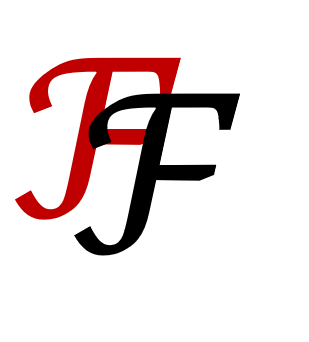

<link rel="icon" type="image/png" href="favicon.png">

  
  F²-Gen: An Open Web Platform for Financial Fraud Simulation

Welcome to **F²-Gen**, a research-driven open-source platform for scenario-based financial fraud data generation and simulation.

---

## 🔗 Get Started

- 🖥️ [Deployment Instructions (Non-Docker)](deploy.html)
- 🐳 [Deployment Guide (Docker)](deploy_docker.html)
- 🧭 [Usage Guide](usage.html)
- 📖 [Technical Plan](technical.html)
- 📂 [Engine](engine.html)
- 📌 [Fraud Scenarios Overview](scenarios.html)
- 🧪 [Playground Demo](playground.html)
- 🎬 [Video Tutorial](tutorial.html)

---

## 📂 Project Resources

  <a href="https://github.com/sethGu/FinancialFraudDataGenerator/archive/refs/tags/v1.0.zip" style="text-decoration: none;">
    <button style="background-color: #007acc; color: white; padding: 10px 20px; border: none; border-radius: 5px; font-weight: bold;">
      ⬇️ Download .zip
    </button>
  </a>
  <a href="https://github.com/sethGu/FinancialFraudDataGenerator/archive/refs/tags/v1.0.tar.gz" style="text-decoration: none; margin-left: 10px;">
    <button style="background-color: #007acc; color: white; padding: 10px 20px; border: none; border-radius: 5px; font-weight: bold;">
      ⬇️ Download .tar.gz
    </button>
  </a>

- [GitHub Repository](https://github.com/sethGu/FinancialFraudDataGenerator)
- Contact:
  > gujunquan@shu.edu.cn or
  > 1525241401@qq.com

---
> This website is under active development. Stay tuned for more updates!
