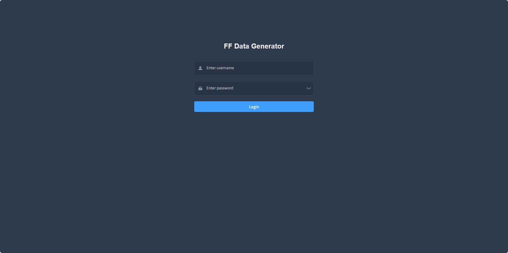

# 🧭 User Guide for F²-Gen: Scenario-Based Financial Fraud Simulation

Welcome to the official usage guide for **F²-Gen**, an open-source platform for visualizing and generating scenario-based financial fraud datasets.

> For a deep dive into the simulation logic, visit the [F²-Gen Engine](engine.html). For theoretical background and design rationale, refer to the [Technical Report](technical.html).

---

## 1. Platform Overview

This platform enables end-to-end simulation and visualization of various financial fraud scenarios. Key features include:

- User login and logout
- Six fraud scenario templates (e.g., credit card abuse, illegal gambling)
- Configurable parameters for each scenario
- Generation of normal and abnormal data
- Interactive data visualizations
- Dataset download support

---

## 2. Login

Upon visiting the platform, users will see a login screen as shown below:

[Image: Login Interface]

- Enter your **username** and **password**.
- Click the **Login** button to access the main interface.

---

## 3. Main Interface

Once logged in, users arrive at the homepage, which contains:

- A **sidebar** for selecting the six fraud scenarios
- A **main area** displaying platform logo and interface widgets
- A top-right icon bar for **Logout** and **Change Password**

[Image: Main Interface Layout]

---

## 4. Fraud Scenario Modules

The platform provides six distinct scenario simulators:

1. Credit Card Cash-Out Fraud
2. Illegal Gambling Transactions
3. Ticket Scalping Fraud
4. Fake Registration Fraud
5. Merchant Violation Transactions
6. Suspicious Transfer Fraud

Each module includes:
- Parameter configuration area
- Normal/abnormal data generation
- Multi-panel visualizations
- Download/export function

---

## 4.1 Credit Card Cash-Out Fraud

Navigate via the sidebar to “Credit Card Cash-Out”. The interface includes seven areas:

[Image: Credit Card Fraud Interface]

**Area 1: Parameter Configuration**
- User Count
- Merchant Count
- Minimum/Maximum Merchant Groups
- Number of Fraudulent Users/Merchants
- Business Hour Ratio
- Simulation Period
- Short- and Long-Term Cash-Out Intervals
- Personal Merchant Ratio
- Start Time

Use the “Reset Parameters” button to restore default values. After setting parameters, check **Generate Normal Data** (optional), then click **Generate Data**.

Once generation completes:
- **Area 2**: Card distribution of normal users/merchants
- **Area 3**: Volume of normal vs abnormal transactions
- **Area 4**: Merchant category breakdown
- **Area 5**: Age distribution of users
- **Area 6**: Abnormal transaction time & amount
- **Area 7**: Normal transaction time & amount

Click **Download Data** to export results, or **Delete Data** to remove generated content.

---

_... other 5 scenarios follow same structure ..._

---

## 5. Logout

Click the icon in the top-right of any page, then click “Logout” to return to the login screen.

[Image: Logout Instruction Screenshot]

---

## 6. Change Password

Click the top-right icon → “Change Password”, then input the **old password**, **new password**, and **confirmation** to update your credentials.

[Image: Change Password Instruction Screenshot]
